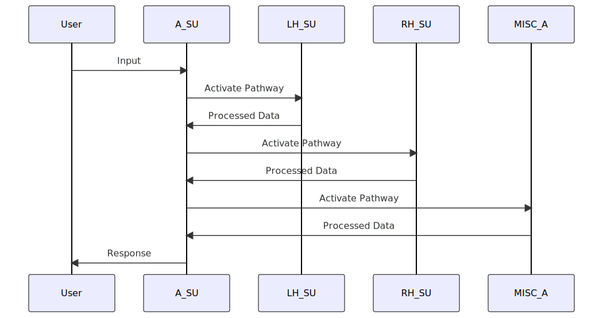

# RI-HEVNAA: Real-time Interrupt-driven Hemispheric Emulated von Neumann Agent Architecture

[https://colab.research.google.com/github/UMN-VR/RI-HEVNAA/blob/main/Notebook.ipynb](https://colab.research.google.com/github/UMN-VR/RI-HEVNAA/blob/main/Notebook.ipynb)

[](https://opensource.org/licenses/MIT)

External Resources:
https://github.com/spcl/graph-of-thoughts
[Code Llama: Open Foundation Models for Code](https://arxiv.org/abs/2308.12950)

RI-HEVNAA (Real-time Interrupt-driven Hemispheric Emulated von Neumann Agent Architecture) is an advanced chatbot architecture designed to replicate the structure and functionality of the human brain. Inspired by principles of biomimicry and von Neumann's computational model, RI-HEVNAA offers a comprehensive framework for building sophisticated and human-like chatbot systems. This repository serves as the development platform for the RI-HEVNAA architecture, providing in-depth documentation, examples, and speculation on its functionalities.

## Table of Contents

- [Overview](#overview)
- [Features](#features)
- [Prerequisites](#prerequisites)
- [Installation](#installation)
- [Usage](#usage)
- [Architecture Components](#architecture-components)
  - [SuperUnits](#superunits)
  - [Agent Central Processing Unit (A-CPU)](#agent-central-processing-unit-a-cpu)
  - [Accelerators](#accelerators)
  - [Pathways and Tasks Paradigm](#pathways-and-tasks-paradigm)
- [Data Flow and Activation](#data-flow-and-activation)
- [Python and JSON Integration](#python-and-json-integration)
- [Optimization Techniques](#optimization-techniques)
- [Real-time Hardware Interaction](#real-time-hardware-interaction)
- [Scalability and Extensibility](#scalability-and-extensibility)
- [Feedback Mechanisms](#feedback-mechanisms)
- [Examples](#examples)
  - [Example 1: Language Processing](#example-1-language-processing)
  - [Example 2: Hardware Interaction](#example-2-hardware-interaction)
  - [Example 3: Natural Language Understanding](#example-3-natural-language-understanding)
- [Contributing](#contributing)
- [License](#license)
- [Acknowledgements](#acknowledgements)
- [References](#references)

## Overview

The RI-HEVNAA architecture is designed to emulate the structure and functionality of the human brain, providing a foundation for building sophisticated and human-like chatbot systems. The architecture comprises SuperUnits, each equipped with an Agent Central Processing Unit (A-CPU) and specialized Accelerators. By leveraging real-time interrupt-driven communication, Python for information processing, and JSON for structured data storage, the RI-HEVNAA architecture enables seamless interaction with hardware components, optimization techniques for enhanced performance, and scalability for additional functionalities.

## Features

- Biomimetic architecture inspired by the human brain
- Modular and hierarchical structure
- Real-time interrupt-driven communication
- Integration of Python for information processing
- JSON for structured data storage
- Optimization techniques for enhanced performance
- Real-time hardware interaction and coordination
- Scalability and extensibility for additional functionalities
- Feedback mechanisms for continuous improvement

## Prerequisites

To run the RI-HEVNAA architecture, ensure you have the following prerequisites:

- Python 3.7 or higher
- Raspberry Pi (recommended) or compatible hardware platform
- Ubuntu operating system

## Installation

1. Clone this repository to your local machine.

```
git clone https://github.com/your-username/RI-HEVNAA.git
```

2. Install the required dependencies.

```
pip install -r requirements.txt
```

3. Connect the necessary hardware components to your Raspberry Pi or compatible hardware platform.

## Usage

The RI-HEVNAA architecture leverages the "Pathways and Tasks" paradigm for information processing

 and execution. Pathways represent sequences of Tasks, with each Task being a specific operation performed by the architecture. By defining and activating appropriate Pathways, the chatbot can perform various tasks and generate meaningful responses.

To run the RI-HEVNAA architecture, follow these steps:

1. Configure the desired Pathways and Tasks in the architecture.
2. Provide input to the chatbot system.
3. Observe the data flow and activation of components as the architecture processes the input.
4. Retrieve the generated response from the chatbot system.

Refer to the [Examples](#examples) section for detailed scenario-based examples of how the RI-HEVNAA architecture operates in various chatbot tasks.

## Architecture Components

The RI-HEVNAA architecture consists of several key components that work together to enable its functionality.

### SuperUnits

The RI-HEVNAA architecture incorporates the following SuperUnits:

1. **Agent SuperUnit (A_SU):** The A_SU serves as the high-level manager of the chatbot system, overseeing system parameters, state transitions, and lifecycle events. It integrates the Bus Manager and hosts the Standalone Chatbot Interface Process (CIP), which provides visualization and enables real-time hardware interaction.

2. **Left Hemisphere SuperUnit (LH_SU):** The LH_SU emulates the left hemisphere of the human brain and focuses on tasks related to speech and language processing. It incorporates the Linguistic Processing Accelerator (LP_A) and the Motor Coordination Accelerator (MC_A).

3. **Right Hemisphere SuperUnit (RH_SU):** The RH_SU emulates the right hemisphere and is dedicated to tasks involving spatial and visual processing. It includes the Sensory Processing Accelerator (SP_A) and the Visual and Spatial Processing Accelerator (VSP_A).


### Agent Central Processing Unit (A-CPU)

Each SuperUnit contains an Agent Central Processing Unit (A-CPU), inspired by the von Neumann architecture. The A-CPU comprises a Control Unit, Memory Unit, and Execution Unit, enabling efficient regulation, storage, and processing of information within the architecture.

### Accelerators

Accelerators are specialized components within each SuperUnit that handle specific operations. The RI-HEVNAA architecture includes various Accelerators tailored to the requirements of each SuperUnit. For example:

- The System Parameter Regulator Accelerator (SPR_A) in the A_SU manages low-complexity signals across the system.
- The State Control Accelerator (SC_A) oversees the overall system state.
- The Linguistic Processing Accelerator (LP_A) in the LH_SU handles language and speech-related tasks.
- The Visual and Spatial Processing Accelerator (VSP_A) in the RH_SU performs spatial and visual-related tasks.
- The Motor Coordination Accelerator (MC_A) interfaces with hardware components to control physical movements.

### Pathways and Tasks Paradigm

The RI-HEVNAA architecture leverages the Pathways and Tasks paradigm, which promotes modularity and code reuse. Pathways are sequences of Tasks, where each Task represents a specific operation implemented as a Python script. Data flows from one Task to another within a Pathway, facilitating seamless information processing and computational efficiency.

By defining appropriate Pathways and activating relevant Tasks, the architecture processes user inputs, performs complex operations, and generates appropriate responses.

## Data Flow and Activation

The RI-HEVNAA architecture facilitates the flow of data and activation of components within the chatbot system. By defining appropriate Pathways

 and activating relevant Tasks, the architecture processes user inputs, analyzes information, and generates meaningful responses.

For example, let's consider a language processing scenario:

1. User Input: The chatbot receives a user input message.

2. Pathway Activation: Based on the user input, the A_SU activates a Pathway related to language processing.

3. Task 1: The A_SU passes the user input to the LH_SU's Linguistic Processing Accelerator (LP_A). LP_A processes the input, performing tasks such as part-of-speech tagging, sentiment analysis, or named entity recognition.

4. Task 2: The output of Task 1 serves as the input for Task 2. The A_SU triggers the MC_A in the LH_SU to generate an appropriate response based on the linguistic analysis.

5. Task 3: The generated response is passed to the RH_SU's Sensory Processing Accelerator (SP_A), which performs additional tasks like context-aware response generation or sentiment adaptation.

6. Task 4: The output of Task 3 is further processed by the VSP_A in the RH_SU, handling spatial and visual-related tasks. This may include generating visual representations or understanding spatial context.

7. Task 5: The final output is passed to the MISC_A, which interfaces with hardware components to execute desired actions, such as robot movements or spatial coordination.

8. Response: The chatbot provides the processed output as a response to the user input.

This example demonstrates the flow of data and the activation of various components within the RI-HEVNAA architecture to handle a language processing scenario. Similar data flow and activation patterns exist for other chatbot tasks, each defined by the specific Pathways and Tasks defined within the architecture.

## Python and JSON Integration

The RI-HEVNAA architecture seamlessly integrates Python for information processing and JSON for structured data storage.

Python is the primary programming language used within the architecture. Python scripts define the Tasks and their corresponding operations within the architecture. These scripts handle various computational tasks, ranging from language processing to hardware interaction.

JSON (JavaScript Object Notation) is employed for structured data storage. It allows efficient retrieval and utilization of information within the architecture. JSON files store relevant data, including user inputs, intermediate processing results, and final responses.

The architecture provides functionalities for reading, creating, and executing Python scripts, as well as storing and retrieving structured data using JSON files. These integration capabilities enable seamless information processing and efficient storage within the RI-HEVNAA architecture.

## Optimization Techniques

The RI-HEVNAA architecture incorporates optimization techniques to enhance performance and efficiency. By continuously analyzing system performance and optimizing key components, the architecture improves its ability to handle chatbot tasks effectively and generate accurate responses.

Optimization techniques include, but are not limited to:

- Optimization of Python code within Tasks to improve computational efficiency.
- Refinement of data structures and algorithms to reduce memory usage and optimize processing speed.
- Utilization of prompt engineering techniques with ChatGPT to improve natural language understanding and response generation.

These optimization techniques are employed during the development and runtime of the architecture, ensuring the chatbot system operates at its full potential.

## Real-time Hardware Interaction

The RI-HEVNAA architecture provides real-time interaction with hardware components, enabling seamless coordination and control of physical devices. By integrating with hardware modules such as servos, LiDAR modules, and Inertial Measurement Units (IMUs), the architecture can perform actions based on sensor inputs and spatial coordination tasks.

For example, in a scenario where the chatbot operates a robot, the MISC_A interfaces with the servos, LiDAR module, and IMUs to execute desired actions. The architecture calculates the appropriate movements based on inputs from other SuperUnits and the environment, enabling the robot to navigate its surroundings effectively

.

This real-time hardware interaction capability extends the chatbot's capabilities, allowing it to interact with and respond to the physical environment in real-time.

## Scalability and Extensibility

The RI-HEVNAA architecture is designed to be scalable and extensible, providing the flexibility to incorporate additional functionalities and integrate with external systems.

The modular and hierarchical structure of the architecture allows for the seamless addition of new SuperUnits, Accelerators, and Tasks, expanding the chatbot's capabilities. Developers can easily define new Pathways and activate relevant Tasks to handle additional chatbot tasks or support new domains.

Furthermore, the architecture integrates with external systems and tools to enhance functionality. For example, by integrating with Puppeteer, the chatbot can navigate the web, retrieve information, and interact with web interfaces. APIs can be incorporated to optimize web searching or facilitate communication via popular platforms like Discord.

This scalability and extensibility empower developers to build sophisticated and domain-specific chatbot systems that cater to a wide range of user requirements.

## Feedback Mechanisms

The RI-HEVNAA architecture incorporates feedback mechanisms for continuous improvement. During the "sleep" phase, the Performance Analysis and Optimization Accelerator (PAO_A) in the A_SU analyzes recent conversations, events, and system logs. Optimization routines, data structure examination, and prompt engineering techniques with ChatGPT are employed to analyze and optimize Tasks, Pathways, and other structures.

This feedback-driven optimization process enables the architecture to adapt and improve over time. By continuously analyzing system performance and incorporating user feedback, the architecture becomes more accurate, efficient, and capable of handling various chatbot tasks.

## Examples

This repository includes comprehensive examples that demonstrate the usage and capabilities of the RI-HEVNAA architecture. These examples provide detailed scenarios, data flow diagrams, and implementation details for various chatbot tasks.

### Example 1: Language Processing

In this example, the chatbot uses the RI-HEVNAA architecture to process user queries and generate appropriate responses. The Pathways and Tasks defined within the architecture enable it to handle tasks such as natural language understanding, sentiment analysis, and context-aware response generation. The example showcases the data flow, activation of components, and the Python and JSON integration within the architecture.

### Example 2: Hardware Interaction

In this example, the chatbot employs the RI-HEVNAA architecture to interact with physical hardware components. The architecture integrates with servos, LiDAR modules, and IMUs to coordinate movements and spatial orientation. The example demonstrates the real-time hardware interaction capabilities of the architecture and showcases the data flow and activation of components involved in physical coordination tasks.

### Example 3: Natural Language Understanding

In this example, the chatbot utilizes the RI-HEVNAA architecture to understand and analyze user inputs. The architecture leverages language processing techniques such as part-of-speech tagging, sentiment analysis, and named entity recognition to extract meaning from user queries. The example provides insights into the data flow, activation of components, and optimization techniques employed within the architecture to enhance natural language understanding.

Developers can refer to these examples to gain a deeper understanding of the RI-HEVNAA architecture and its functionalities.

## Contributing

Contributions to the RI-HEVNAA architecture are welcome! Whether it's bug fixes, new features, or improvements, please feel free to submit pull requests. Before contributing, please read our [contribution guidelines](CONTRIBUTING.md) for more details.

## License

This project is licensed under the [MIT License](LICENSE).

## Acknowledgements

We would like to express our gratitude to the open-source community for their contributions and support in developing the RI-HEVNAA architecture.

## References

[To be added based on citations in the repository]

Please note that the RI-HEVNAA

 architecture described in this README is fictional and serves as a reference for understanding the concepts and components of an advanced chatbot architecture.


### ⚠ Parts of this repo were made by GoldyChat through ChatGPT4 ⚠
use with caution 
